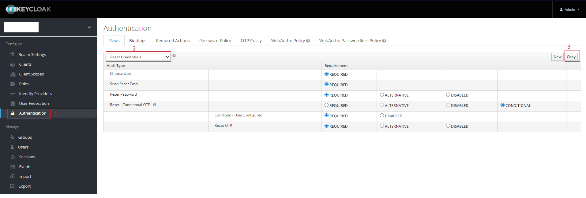
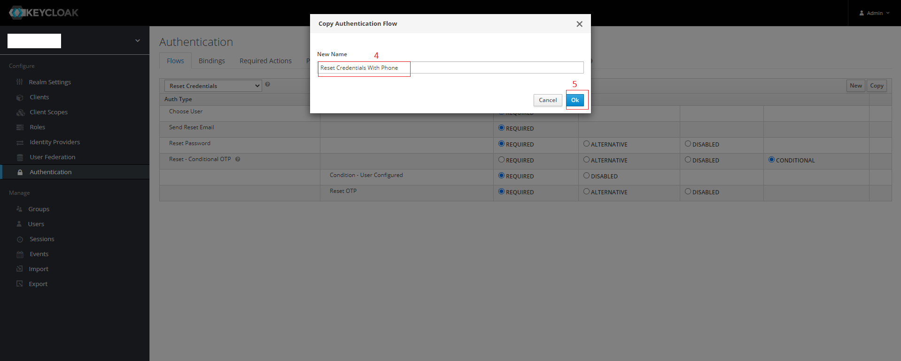
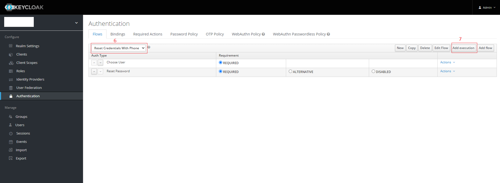
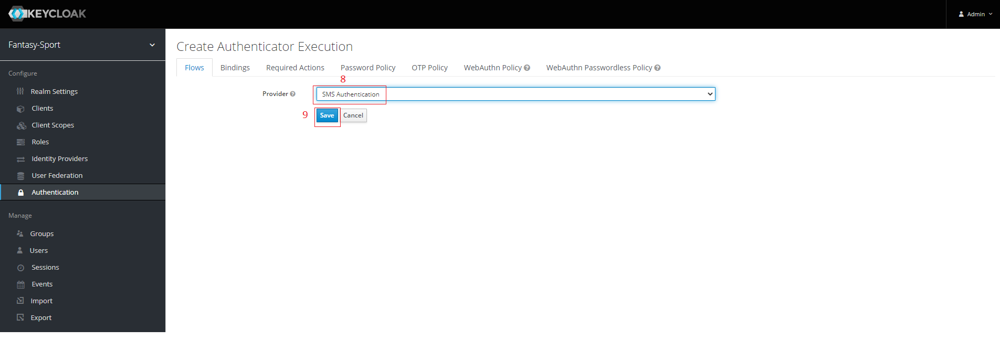
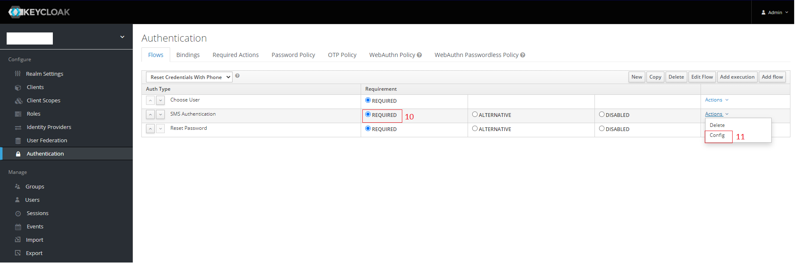
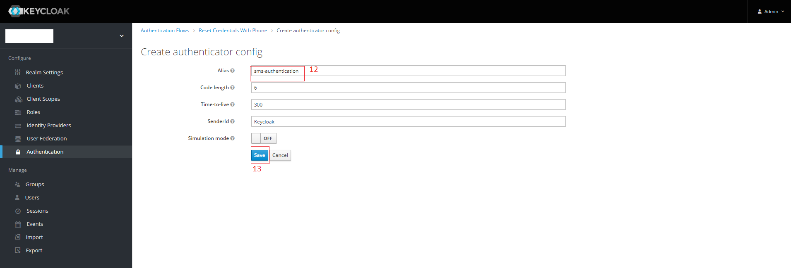
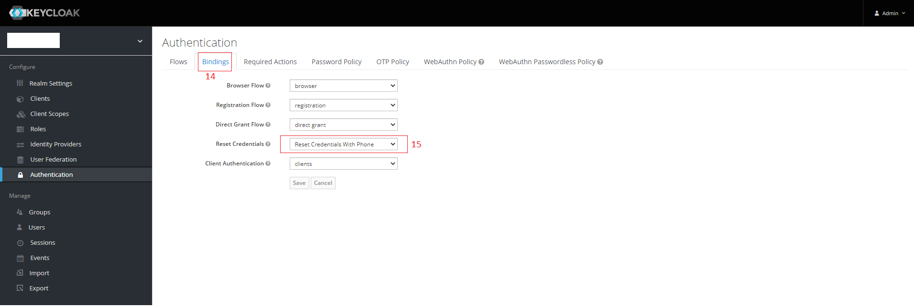

# Keycloak 2FA SMS Authenticator With Twilio
Forked from dasniko/keycloak-2fa-sms-authenticator

## How to intergrate with keycloak version 12.0.1
### 1. Build and deploy the jar file.
- Prepare environment Java on your local machine: JDK var 8 or 11, maven 3.6+
- Run ```mvn clean install```
- Put the jar file ```io.hitatek-keycloak-2fa-sms-authenticator-1.0-SNAPSHOT.jar``` into the folder YOUR_SOURCE_CODE/Keycloak/providers
- Copy the jar file to the keycloak server. \
  Example: Here I am using docker environment
```
docker cp ./Keycloak/providers:/opt/jboss/keycloak/standalone/deployments
```

### 2. Registration an account free on Twilio https://www.twilio.com/
- After registering account successfully, Twilio will provide for you some keys: ACCOUNT SID, AUTH TOKEN, PHONE NUMBER.
- Make sure that some variables below already exist in your docker environment.
  TWILIO_ACCOUNT_SID, TWILIO_AUTH_TOKEN, TWILIO_PHONE_NUMBER
  ```
  docker run ... \
  -e TWILIO_ACCOUNT_SID=ACCOUNT SID\
  -e TWILIO_AUTH_TOKEN=AUTH TOKEN \
  -e TWILIO_PHONE_NUMBER=PHONE NUMBER \
  quay.io/keycloak/keycloak:12.0.1
  ```

### 3. Update the configuration on the keycloak
Create the sms authentication flow as below:








